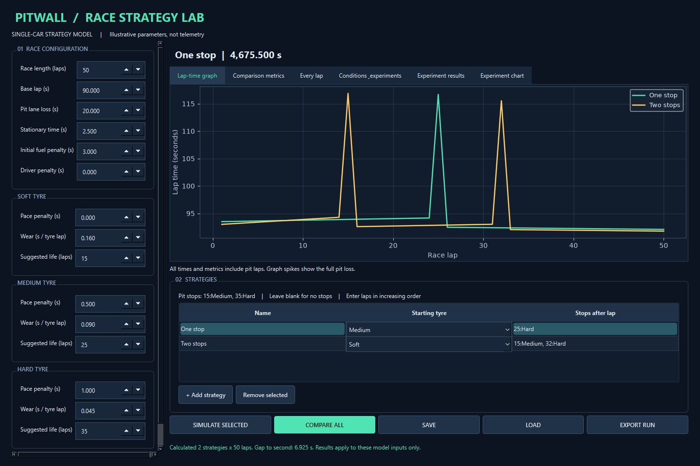
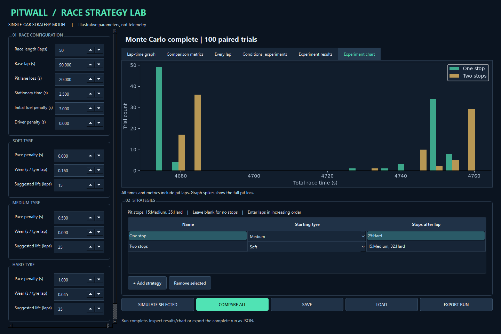

# PITWALL

**Motorsport Race Strategy Simulation and Optimisation System**

## Overview
PITWALL is a Python/PySide6 desktop application for exploring how tyre choice, degradation, fuel, pit stops and changing race conditions affect strategy. Configure a race, compare alternative plans, examine uncertainty with paired Monte Carlo trials and search for the fastest strategy within a defined set of constraints.

## Features
- Configurable race length, base pace, driver penalty, fuel effect and three dry tyre compounds.
- Strategy editing with ordered pit stops and per-stop service times.
- Deterministic simulation with per-lap results, cumulative times and comparison metrics.
- Chronological weather and safety-car events with explicit ordering rules.
- Seeded lap variation and paired Monte Carlo trials with summary statistics.
- Bounded strategy search with candidate counts and baseline comparisons.
- Lap-time graphs, ranked search results and Monte Carlo histograms.
- Versioned JSON scenarios, complete experiment exports and cancellable background runs.

## Screenshots
### Strategy comparison



### Monte Carlo analysis



Both images are captures of the running Windows application using illustrative model parameters.

## How It Works
Inputs are validated and converted into immutable models. The engine advances one lap at a time, applies scheduled conditions, calculates time components and records each result. Comparison ranks total times; experiments repeat this same model. Pit stops happen after their numbered racing lap, while events happen before it.

## Algorithms
- **Lap calculation:** base pace plus tyre, fuel, pit, weather, safety-car and optional random terms.
- **Tyre degradation:** linear loss based on completed laps on the current tyre set.
- **Event processing:** a heap orders events by lap and original input order for ties.
- **Strategy comparison:** total race time ranks plans under identical conditions; exact ties retain input order.
- **Monte Carlo:** paired trials share a seed and conditions, with optional random safety-car occurrence and timing. Results include mean, median, population standard deviation and win/tie probabilities.
- **Optimisation:** enumerate legal zero-, one- and two-stop plans on a constrained pit-lap grid, simulate each candidate and rank the complete set. Search uses fixed events with random lap variation disabled.

Pseudocode and complexity notes are in [design records](docs/design/architecture.md).

## Architecture
The computational model is separated from the desktop interface. Immutable dataclasses represent race inputs and results; pure functions calculate lap components; the engine applies events and advances race state.

| Layer | Responsibility | Modules |
|---|---|---|
| Data model | Typed inputs, results and validation | `models.py`, `conditions.py` |
| Simulation | Lap calculations, event queue and race state | `physics.py`, `events.py`, `engine.py` |
| Analysis | Comparison, repeated trials and bounded search | `comparison.py`, `monte_carlo.py`, `optimiser.py` |
| Persistence | Strict versioned JSON and atomic scenario saves | `persistence.py` |
| Desktop | PySide6 widgets, Matplotlib charts and background workers | `gui.py`, `advanced_gui.py` |

See the [architecture diagrams](docs/design/implemented-structure.md) and [design records](docs/design/architecture.md) for the class relationships and data flow.

## Installation
The verified environment is Windows 11 with Python 3.14, PySide6, Matplotlib and pytest. Other Python/OS combinations have not been verified.

From the PITWALL directory, create a short environment path on Windows:

```powershell
python -m venv "$env:TEMP\pitwall-0460-venv"
& "$env:TEMP\pitwall-0460-venv\Scripts\python.exe" -m pip install -r requirements-lock.txt
& "$env:TEMP\pitwall-0460-venv\Scripts\python.exe" main.py
```

`requirements-lock.txt` records the tested dependency versions; `requirements.txt` records dependency ranges. A short environment path avoids the PySide6 path-length installation error encountered in the nested development workspace.

For the existing setup, launch with:

```powershell
.\launch.ps1
```

The launcher uses `%TEMP%\pitwall-0460-venv` when available. Windows may clean temporary directories, so recreate this environment if necessary. Use the short-path environment above if Qt installation fails in a deeply nested workspace.

## Running
1. Configure the race and tyre parameters.
2. Edit strategy rows. Enter stops as `15:Medium, 35:Hard`, or leave the field blank for no stops. An optional service-time override uses `25:Hard:3.0`.
3. Select a strategy and simulate, or compare all rows. Inspect the graph, metrics and every-lap tabs. Editing inputs clears previous results.
4. Open **Conditions & experiments** to configure weather, events, seed, variation and analysis controls. Scroll the tab to reach experiment actions.
5. Enter events such as `10:Wet, 15:SC_START, 18:SC_END, 25:Dry`.
6. Run Monte Carlo using the first two strategy rows, or run the optimiser with the chosen search constraints. Use **CANCEL RUN** to cancel background work.
7. Use **SAVE/LOAD** for scenarios and **EXPORT RUN** for complete experiment inputs and results. Example scenarios are in [scenarios](scenarios/).

Pit stops occur **after** the specified racing lap; fresh tyres run the following lap. Events occur **before** their specified lap. Same-lap events follow input order.

## Testing
The latest recorded full verification run passed **87 tests**, covering model validation, manual calculation examples, event ordering, reproducibility, search, persistence and GUI integration.

```powershell
& "$env:TEMP\pitwall-0460-venv\Scripts\python.exe" scripts/run_tests.py TEST-LOCAL
& "$env:TEMP\pitwall-0460-venv\Scripts\python.exe" scripts/benchmark.py
```

The test runner retains stdout/stderr, JUnit XML, execution metadata and source hashes in a unique directory. Earlier failures and retests are preserved. Benchmark records include raw timings and machine details. See [final verification](docs/testing/final-quality-results.md).

The original development evidence is retained separately. The new comparison benchmark is `scripts/benchmark_comparison.py`; it measures computation without GUI rendering.

## Example Scenarios
Load [dry comparison](scenarios/dry-comparison.json) to explore different stop plans. Other JSON files in [scenarios](scenarios/) demonstrate saved inputs. Scenario values are illustrative.

## Limitations
- Parameters are illustrative and have not been calibrated against real race telemetry.
- The model represents one car on a free track, with linear tyre wear and a simplified fuel penalty.
- Only dry compounds are available. Weather penalties apply equally across them; wet/intermediate tyre selection is unsupported.
- Safety-car effects approximate lap delay and relative pit loss without modelling field bunching. Overlapping fixed/generated commands use state assignments.
- Search returns the best result within its grid and constraints. It does not establish a globally optimal real-world strategy or enforce FIA compound rules.
- Limits are 1..500 race laps, 2..20 compared strategies and up to 1,000 Monte Carlo trials. Search permits up to two stops and rejects work beyond 10,000 candidates or two million lap evaluations.
- GUI inputs use three decimal places and finite ranges. Loading an unrepresentable value fails before changing the current inputs.

Further maintenance considerations and improvements are in the [technical evaluation](docs/evaluation/review.md).

## Project Documentation
The [NEA document](NEA/README.md), [architecture](docs/design/implemented-structure.md) and [technical evaluation](docs/evaluation/review.md) explain the project. Development records, source references and required declarations are maintained in the documentation, including the [assistance log](docs/assistance-log.md).

## Licence
Original PITWALL software is available under the [MIT License](LICENSE). See [licensing scope](docs/licensing.md) for exclusions.
