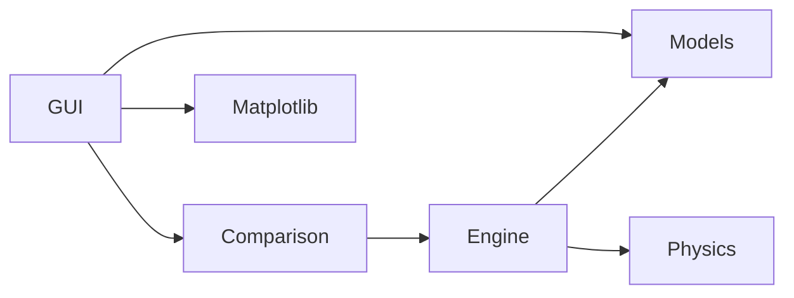

# First milestone design, recorded before implementation

## Problem decomposition

1. Describe a race and tyre properties.
2. Decide whether an input strategy is meaningful.
3. Calculate how each lap consumes tyre life and fuel.
4. Accumulate time and apply stops at a defined boundary.
5. Compare alternatives under the same conditions.
6. Present inputs, explain errors and expose output.

## Planned architecture

`models.py` owns immutable typed inputs and results plus validation. `physics.py` owns pure scalar calculations. `engine.py` owns lap iteration. `comparison.py` owns ranking and summary calculations. `gui.py` converts widget inputs into model objects and plots real output. Computational modules do not import Qt.



## Core classes and units

| Class | Responsibility and fields |
|---|---|
| Compound (enum) | SOFT, MEDIUM, HARD identifiers |
| Circuit | name, base_lap_time (seconds), pit_lane_loss (seconds) |
| Driver | name, pace_delta (non-negative seconds relative to circuit baseline) |
| TyreCompound | name, base_pace_delta (non-negative seconds), degradation_rate (seconds per completed tyre lap), recommended_life (positive laps) |
| PitStopPlan | lap (pit at end of lap), compound, stationary_time (seconds) |
| Strategy | name, starting_compound, ordered immutable tuple of stops |
| RaceConfig | laps (1..500), circuit, driver, three tyre definitions, initial_fuel_penalty (seconds) |
| RaceState | completed_laps, compound, tyre_age, cumulative_time |
| LapResult | lap_number, lap_time, cumulative_time, compound used for racing lap, tyre_age, degradation_loss, fuel_effect, pit_stop, pit_loss |
| StrategyResult | strategy, immutable lap results, derived total_time |

Input objects validate on construction. Cross-object strategy validation checks final race length. Result/state objects validate types, bounds and finite times; cross-lap correctness is tested at the engine level. Floats reject NaN and infinity, negative values and booleans. Integers reject booleans. Tuple collections prevent caller mutation after validation.

## Decisions

| Decision | Options | Choice and reason | Disadvantage |
|---|---|---|---|
| Stop boundary | Start or end of lap | End: old tyre runs lap L, pit time added on L, new tyre age 0 on L+1 | Needs explicit UI wording |
| Pace deltas | Signed or non-negative | Non-negative penalty above a theoretical baseline, as brief rejects negative parameters | Baseline must be the fastest reference |
| Fuel | Mass model or direct penalty | Initial penalty times remaining-lap fraction, zero on last lap | No refuelling or physical mass calibration |
| Tyre wear | Linear or quadratic | Linear first, easiest to test | No abrupt cliff |
| GUI strategy editor | Complex drag editor or rows | Named strategy rows and explicit stop syntax | Syntax needs guidance |

Final-lap stops are rejected: no subsequent racing stint benefits. Repeated same-compound stops are allowed. Recommended life is informational, not a mandatory stop rule. No FIA compound rule is imposed.

## Iteration 1 design and planned tests

Requirement: FR01..FR04. Implement the classes above, without race arithmetic.

Language-independent A04/A14 validation:

```text
REQUIRE race length is an integer in [1,500]
REQUIRE finite non-negative numeric model parameters
REQUIRE positive base lap time and positive recommended tyre life
REQUIRE exactly one definition for each supported compound
REQUIRE a supported starting compound
previous = 0
FOR each planned stop in supplied order
    REQUIRE previous < stop.lap < race length
    REQUIRE supported stop compound and non-negative stationary time
    previous = stop.lap
RETURN valid
```

Complexity O(S + C), S stops and C tyre definitions. Do not sort invalid stop input silently.

Planned tests TEST-I01: valid defaults; races 1 and 500; reject 0, -1, 501, fractions, bool; invalid compound; duplicate/missing tyres; negative, non-finite parameters; missing start; duplicate, unordered and final-lap stops; invalid result objects. Expected outcomes are construction success or explanatory ValueError, not invented test results.

Later iterations will receive their own designs before code is added.
