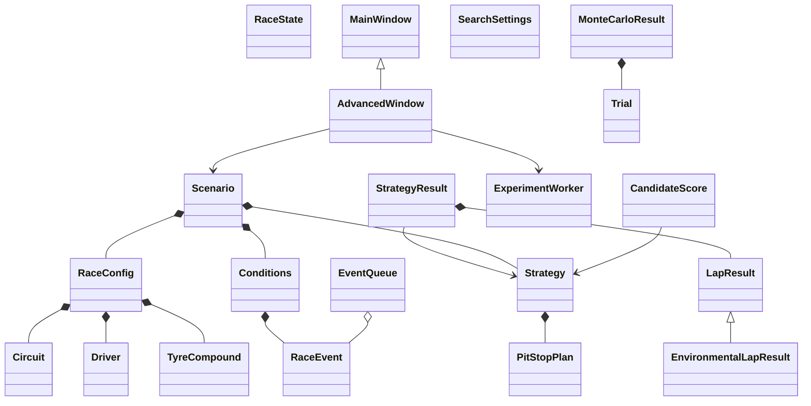
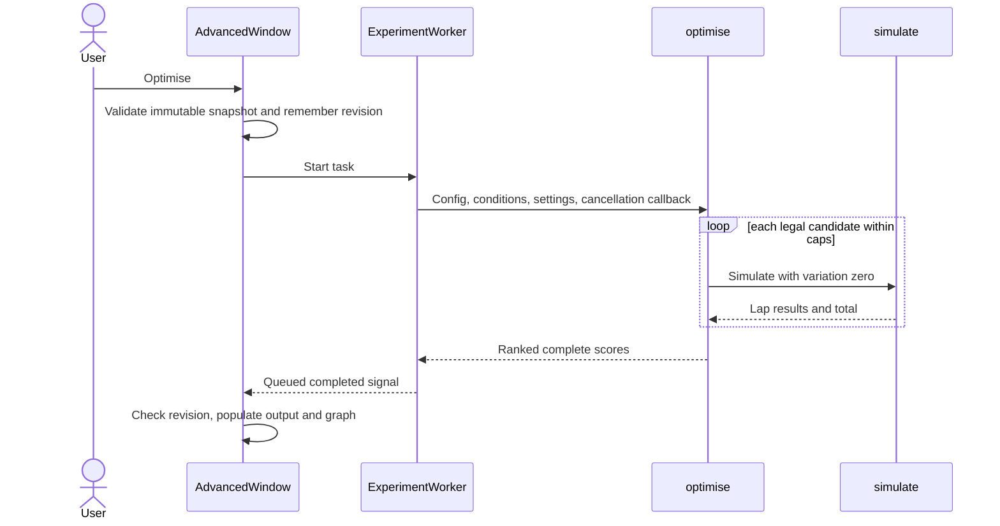

# Implemented structure at the integrated prototype

This diagram reflects real classes after Iteration16, not the earlier planned diagram. The design files remain as chronological records.

RaceState is a temporary immutable state in the engine loop. SearchSettings constrains generator enumeration; CandidateScore retains candidate and total. MonteCarloResult retains trials and derived statistics. Enum definitions live in models/events; no weather/SC state is invented in earlier-stage LapResult.

Validation responsibility: local numeric/enum checks in models/conditions; race-dependent stops/events in engine/scenario; JSON types and exact keys in persistence; widget representability before loaded data is applied; work limits in search/Monte Carlo. Computational routines import no GUI components.

Maintenance hotspots: adding enum members affects config completeness, defaults, GUI choices, persistence decoding and tests; changing a formula requires updating the independent oracle deliberately; schema changes need version migration, not silently accepting fields; additional event states need explicit ordering semantics.
